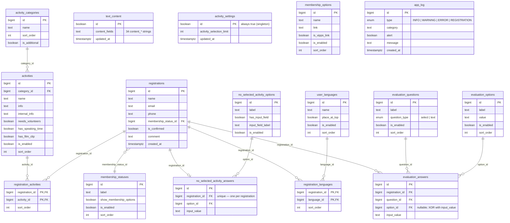
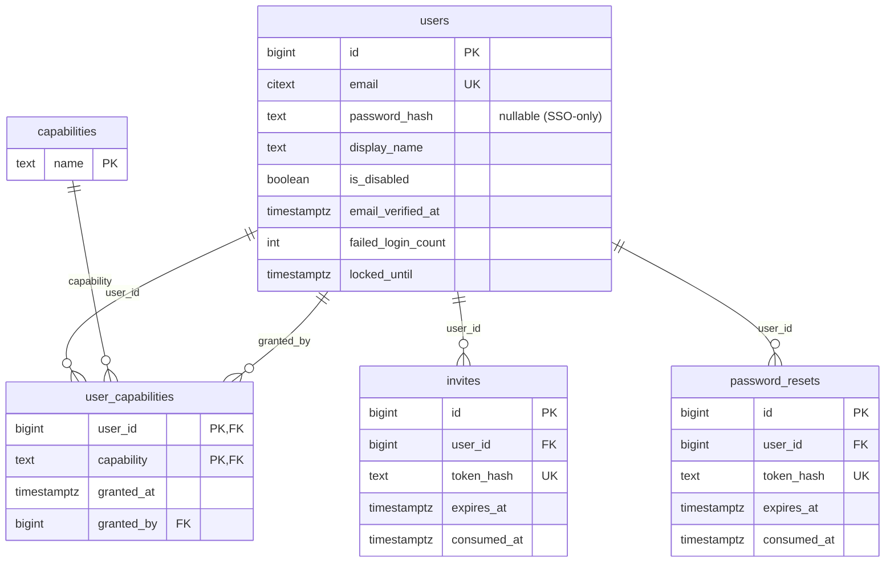

# Data model

Railway's database is one PostgreSQL instance with two schemas: `railway` (the application's editorial content, submissions, and operational log) and `auth` (staff identities and capability grants). Both schemas are owned by the `railway_owner` role and exposed to PostgREST exactly once — only the `railway` schema is queryable over HTTP; `auth` is locked down to direct in-cluster access.

The full DDL is the source of truth and lives under [`db/`](https://github.com/terchris/railway/tree/main/db):

| File | Contents |
|---|---|
| [`01-roles.sql`](https://github.com/terchris/railway/blob/main/db/01-roles.sql) | The four PostgreSQL roles (`railway_owner`, `anon`, `authenticated`, `authenticator`). See [PostgreSQL roles](postgres-roles.md). |
| [`02-schemas-and-extensions.sql`](https://github.com/terchris/railway/blob/main/db/02-schemas-and-extensions.sql) | Schemas + `citext` for case-insensitive email. |
| [`03-tables.sql`](https://github.com/terchris/railway/blob/main/db/03-tables.sql) | All tables, enums, indexes, and the `set_updated_at` trigger. The authoritative shape. |
| [`04-rpcs-and-views.sql`](https://github.com/terchris/railway/blob/main/db/04-rpcs-and-views.sql) | `has_capability`, `submit_registration`, `log_event`, `app_log_alert_count`, and the `public_form_payload` view. |
| [`05-rls.sql`](https://github.com/terchris/railway/blob/main/db/05-rls.sql) | Row-Level-Security policies — every policy targets `TO anon`, gated by `auth.has_capability(...)` against the JWT's `capabilities` array. |

The ERD below is a hand-drawn summary of relationships. For column-level detail, follow the table-name link straight into the DDL.

## ERD — `railway` schema

## ERD — `auth` schema

Not exposed to PostgREST. Reached only from inside the cluster (or via `psql` for staff bootstrap). The `capabilities` array inside each staff JWT is sourced from `auth.user_capabilities` via the `auth.effective_user_capabilities` view, which expands `admin` to imply every other capability.

The nine seeded capability names: `content:read`, `content:write`, `registrations:read`, `registrations:write`, `users:read`, `users:write`, `app_log:read`, `app_log:write`, `admin`.

## Tables grouped by purpose

### Editorial (admin-managed content)

The wizard reads these to render fields and labels; admins edit them through `/admin/*`. Public reads go through the [`public_form_payload`](https://github.com/terchris/railway/blob/main/db/04-rpcs-and-views.sql#L64) view (anon), which packages the relevant subset into one round-trip.

| Table | Notes |
|---|---|
| `text_content` | **Singleton** — `id boolean primary key default true check (id)` forces exactly one row holding 34 `content_*` strings. Edit-in-place. |
| `activity_settings` | **Singleton** — holds `activity_selection_limit`. |
| `activity_categories` | Sortable groupings shown above each activity list. `is_additional=true` puts the category in the "additional" section. |
| `activities` | Each row is one selectable activity. `category_id` references `activity_categories`. Flags `needs_volunteers`, `has_speaking_time`, `has_film_clip`, `is_enabled` drive UI variants. |
| `user_languages` | Optional language tags on a registration. `place_at_top` pins frequently-used languages above the rest. |
| `membership_statuses` | Radio-button options on the membership step. `show_membership_options=true` reveals the membership-link list. |
| `membership_options` | Links shown when a membership status with `show_membership_options=true` is picked (e.g. Vipps payment link). |
| `no_selected_activity_options` | Reasons the user might give for selecting no activities. `has_input_field=true` lets the user type a free-text addendum. |
| `evaluation_questions` | The post-form questionnaire. `question_type='select'` uses `evaluation_options`; `question_type='text'` uses free-text only (no option row). |
| `evaluation_options` | Pre-defined answer choices for `question_type='select'` questions. |

### Submission (per-registration data)

Inserted in one transaction by the [`submit_registration`](https://github.com/terchris/railway/blob/main/db/04-rpcs-and-views.sql#L96) RPC. Never touched directly from the Next app's public surface — always via the RPC.

| Table | Notes |
|---|---|
| `registrations` | The submission itself: name, email, phone, comment, `membership_status_id`. The `is_confirmed` flag is admin-side; default `false`. |
| `registration_activities` | Many-to-many join — which activities a registration selected, with `sort_order`. `ON DELETE CASCADE` from `registrations`, `ON DELETE RESTRICT` from `activities` (an activity referenced by a registration cannot be deleted). |
| `registration_languages` | Many-to-many join — same `CASCADE`/`RESTRICT` shape as activities. |
| `no_selected_activity_answers` | At most one row per registration (note the `UNIQUE` on `registration_id`). Captures which "no activity selected" reason the user picked, plus any free-text addendum. |
| `evaluation_answers` | Per-question answer. Constraint `evaluation_answer_has_value` enforces XOR: either `option_id` is set (for `select` questions) **or** `input_value` is set (for `text` questions), never both, never neither. `evaluation_answer_one_per_question` prevents duplicate rows for the same `(registration_id, question_id)`. |

### Operational

| Table | Notes |
|---|---|
| `app_log` | One-table audit / alert log. `type` enum: `INFO`, `WARNING`, `ERROR`, `REGISTRATION`. `alert=true` rows are what `app_log_alert_count()` counts and what `/admin/app-log` highlights. Writes go through the [`log_event`](https://github.com/terchris/railway/blob/main/db/04-rpcs-and-views.sql#L318) RPC. |

### Auth (locked down — not exposed to PostgREST)

| Table | Notes |
|---|---|
| `auth.users` | Staff identity. `password_hash` is nullable for SSO-only users; `failed_login_count` and `locked_until` are the lockout knobs. `email` is `citext`. |
| `auth.capabilities` | Lookup table; the nine names listed above are inserted as part of `03-tables.sql`. |
| `auth.user_capabilities` | Grants. `granted_by` references another `auth.users.id` for audit. |
| `auth.invites`, `auth.password_resets` | Single-use, hashed-token tables for invite + reset flows. `consumed_at` flips on successful redemption. |
| `auth.effective_user_capabilities` (view) | Joined view that expands `admin` to imply every other capability. The JWT-issuing code reads this view, not the raw table. |

## Constraints worth knowing

A few non-obvious shape decisions you'll hit when querying or seeding:

- **Singletons via `id boolean primary key default true check (id)`** — `text_content` and `activity_settings` cannot have more than one row. UPSERT pattern: `INSERT ... ON CONFLICT (id) DO UPDATE`.
- **`evaluation_answers` XOR check** — either `option_id` is set or `input_value` is non-empty, never both. Seeders and the `submit_registration` RPC honor this; if you write directly you'll see `evaluation_answer_has_value` rejections.
- **Cascade asymmetry on the join tables** — deleting a registration cascades to its `registration_activities` / `registration_languages` rows; deleting an activity or language is **restricted** if any registration references it. This is deliberate: editorial deletes shouldn't quietly mutate historical submission data.
- **Identity columns use `generated always as identity`** — you cannot assign `id` manually except via `OVERRIDING SYSTEM VALUE`. Sample-data seeders that need stable IDs do this explicitly.
- **`updated_at` is trigger-maintained** — `railway.set_updated_at()` runs `BEFORE UPDATE` on every editorial table + `auth.users`. Updates that don't change anything still touch the timestamp; ETL diffs should compare meaningful columns, not `updated_at`.

## Related

- [API surface](api-surface.md) — which routes and RPCs touch which tables
- [PostgreSQL roles](postgres-roles.md) — `railway_owner` ownership, `anon` / `authenticated` posture, why all RLS policies target `TO anon`
- [`db/README.md`](https://github.com/terchris/railway/blob/main/db/README.md) — operational notes on running the bundle against UIS
